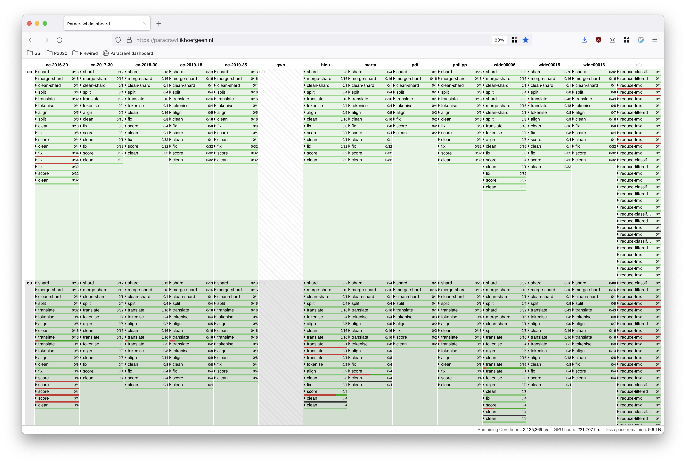

# ParaCrawl++ Dashboard

Dashboard, initially developed for ParaCrawl, that hooks into [cirrus-scripts](https://github.com/paracrawl/cirrus-scripts) and displays all the jobs that are being executed.



## Installation
Just clone the repository, and have some environment with Python 3.8. There are no python dependencies. (I had fun implementing everything myself.)

## Usage
This is an example of my ParaCrawl set-up.

Have a script, say paracrawl.sh, in the same folder as the dashboard.py script itself:

```bash
#!/bin/bash
set -euo pipefail

# So I don't need to make dashboard.py in my cwd
DASHBOARD_PATH=$(dirname $(realpath "${BASH_SOURCE[0]}"))

# This is for csd3, adjust for your own cluster
module load python/3.8

# Change the current working directory to that of your local cirrus-scripts 
# copy. It will use this for reading configuration etc.
cd ~/src/cirrus-scripts/

# Run the dashboard
python3 $DASHBOARD_PATH/dashboard.py "$@"
```

Then, connect an ssh session with port forwarding:

```bash
ssh -L 8081:localhost:8081 you@your.cluster
```

From that session, then start your paracrawl.sh with the port number you just forwarded:

```bash
path/to/paracrawl.sh 8081
```

It should now say something like:

```
Serving HTTP on 0.0.0.0 port 8081 (http://0.0.0.0:8081/) ...
```

and you can connect your browser to http://localhost:8081/ and get the interface if everything works.
